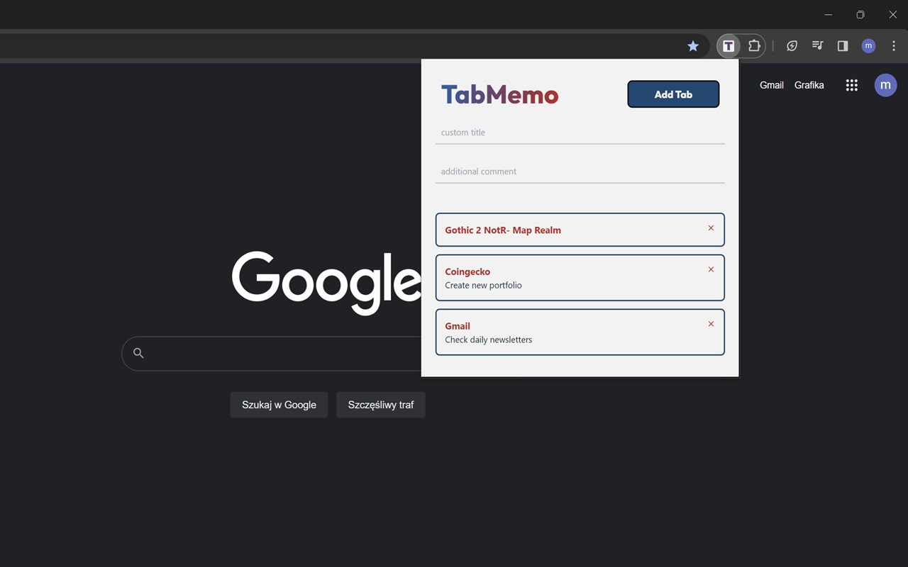

# TabMemo

Easy way to keep all pages you need to check later in one place without making a mess in your browser bookmarks.

**[Official page](https://chromewebstore.google.com/detail/tabmemo/phdmmfiahmnpnplegibamophhcbbakoo)** on Chrome Web Store

 

#### Upcoming Features

- Add Tab with short description of page content generated using ChatGPT.

 

#### Changes

_v 1.1.1 - Fix: Unique keys of list elements_

- Implementation of randomUUID() method for unique keys of `<li>` elements.

 

_v 1.1 - Feat: Added AnimatePresence and Prettier_

- List with tabs now moves smoothly to fill the gap after removed element thanks to AnimatePresence feature in Framer Motion library for React.
- All code was formatted using Prettier

