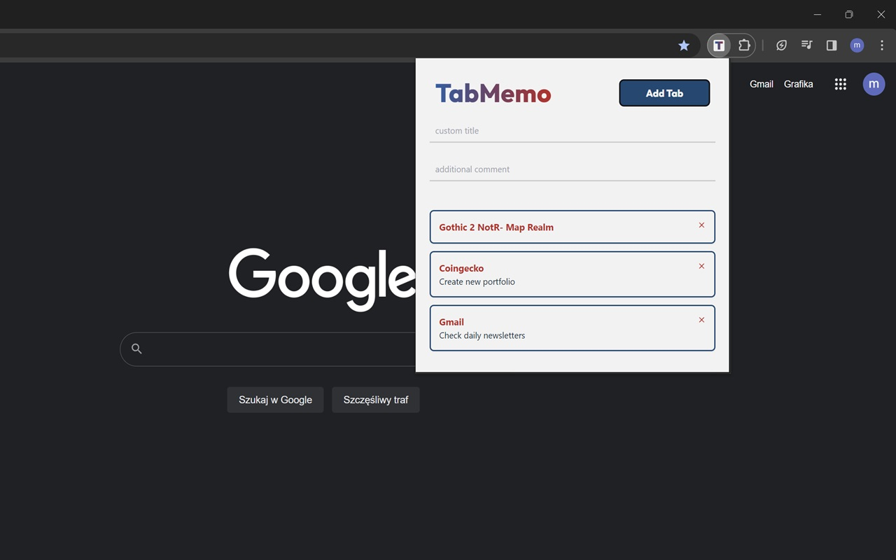

# TabMemo - Chrome Extension

## Introduction

This project is a Chrome extension that allows users to attach notes to their browser tabs. It's designed for users who work with multiple tabs and need an easy way to remember tasks or notes associated with each one. TabMemo provides a simple, responsive interface for quickly adding, viewing, and managing notes directly from the browser.

<br>

## Table of Contents

- [Features](#features)
- [Project Structure](#project-structure)
- [Installation](#installation)
- [Usage](#usage)
- [Roadmap](#roadmap)
- [Updates](#updates)
- [License](#license)
- [Author](#author)

## Features

- **Tab-Specific Notes**: Attach custom notes to each open browser tab for easy tracking.
- **Tab List Overview**: View all tabs with their associated notes in a structured list.
- **Simple UI**: User-friendly and responsive interface built using Tailwind CSS.
- **Local Storage**: Notes are saved locally, ensuring privacy and fast access.

## Project structure

- **App.jsx**: The core logic of the application, handling state management and rendering the UI.
- **TabForm.jsx**: Component responsible for note creation and input handling.
- **TabList.jsx**: Displays the list of tabs with their corresponding notes.
- **main.jsx**: The entry point for rendering the React app.
- **index.css**: Custom CSS and Tailwind utility classes for styling the extension.
- **README.md**: Documentation for the project.
- **LICENSE**: Licensing information for the project.

## Installation

To set up this project locally, follow the steps below:

1. **Download from Chrome Web Store**:

   - Go to the [TabMemo Chrome Web Store page](https://chromewebstore.google.com/detail/tabmemo/phdmmfiahmnpnplegibamophhcbbakoo) and click "Add to Chrome".
   
2. **Development Setup** (for local development):

   ```bash
   git clone https://github.com/yourusername/tabmemo.git
   ```

3. **Navigate to the project directory**:

   ```bash
   cd tabmemo
   ```

4. **Install dependencies**:

   ```bash
   npm install
   ```

5. **Run the development server**:

   ```bash
   npm start
   ```

## Usage


1. **Creating a Note**:
   - Click the TabMemo icon in the browser toolbar.
   - Enter your note in the input field and it will be saved automatically.

2. **Viewing Notes**:
   - Open the extension to see a list of all your saved tabs and notes.
   - Click on a tab in the list to navigate to it.

3. **Managing Notes**:
   - Edit or delete notes from the tab list interface.


## Roadmap

- **Sync Across Devices**: Add cloud sync functionality for accessing notes across multiple devices.
- **Customizable Themes**: Allow users to switch between light and dark themes for the extension.
- **Search Functionality**: Implement a search feature to quickly find specific notes.

## Updates

_v 1.1.1 - Fix: Unique keys of list elements_
- Implementation of randomUUID() method for unique keys of `<li>` elements.

<br>

_v 1.1 - Feat: Added AnimatePresence and Prettier_

- List with tabs now moves smoothly to fill the gap after removed element thanks to AnimatePresence feature in Framer Motion library for React.
- All code was formatted using Prettier


## License

This project is licensed under the [MIT](https://github.com/yourusername/tabmemo/blob/main/LICENSE) License.

## Author

- [GitHub](https://www.github.com/michalski-marcin)
- [LinkedIn](https://www.linkedin.com/in/michalski-marcin)
- [Webpage](https://www.michalski.pro)
